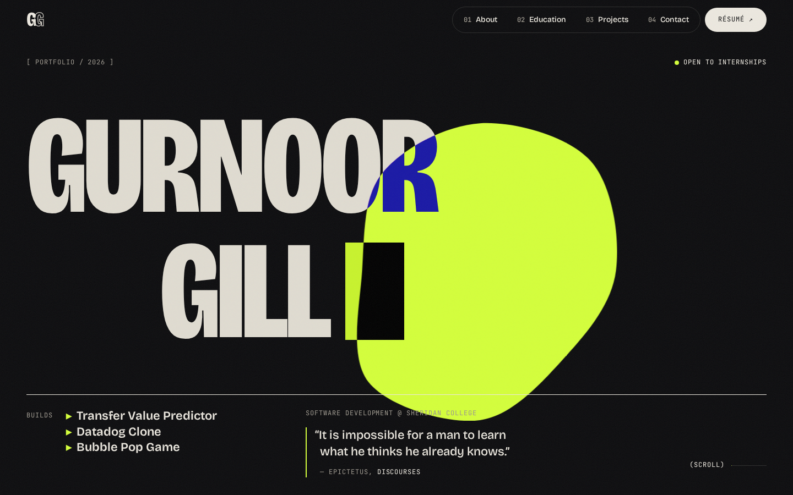

# Gurnoor Gill — Portfolio

A bold, single-page portfolio built from scratch with Astro and TypeScript.

**[gill-g.github.io/personal-portfolio →](https://gill-g.github.io/personal-portfolio/)**



## About

I'm a Software Development & Network Engineering student at Sheridan College, focused on
full-stack development, cloud and machine learning. This site is where I share who I am,
what I've built and how to reach me. I designed and built it myself, and it grows as I do.

## Highlights

- **One page, five sections.** Home, About, Education, Projects and Contact, with tabs that
  glide to each section and track where you are as you scroll.
- **Smooth, responsive motion.** Inertial scrolling, text that reveals as it scrolls into
  view, and marquee bands that speed up and reverse with your scroll.
- **A living centerpiece.** A lime blob that slowly morphs and leans toward your cursor. It
  returns as the artwork on each project card.
- **A header that gets out of the way.** It hides while you read and slides back when you
  scroll up or reach for the top of the screen.
- **Dark and light themes** that follow your system setting.
- **Accessible by design.** Full keyboard support, WCAG AA contrast in both themes, and
  animations that switch off for anyone who prefers reduced motion.
- **Fast.** Static HTML with no framework running in the browser, deployed automatically on
  every push.

## Built with

| | |
| --- | --- |
| **Framework** | [Astro](https://astro.build) (static output) |
| **Language** | TypeScript |
| **Styling** | Hand-written CSS with design tokens |
| **Motion** | [Lenis](https://github.com/darkroomengineering/lenis) smooth scrolling, native CSS and JavaScript animation |
| **Type** | [Bricolage Grotesque](https://fonts.google.com/specimen/Bricolage+Grotesque) and [JetBrains Mono](https://fonts.google.com/specimen/JetBrains+Mono) |
| **Hosting** | GitHub Pages, deployed with GitHub Actions |

## Run it locally

```bash
npm install
npm run dev
```

Then open http://localhost:4321/personal-portfolio/.

## Contact

- **Email:** [gillg.dev@gmail.com](mailto:gillg.dev@gmail.com)
- **LinkedIn:** [linkedin.com/in/gurnoor-gill-a33280431](https://www.linkedin.com/in/gurnoor-gill-a33280431/)
- **Résumé:** [view PDF](https://gill-g.github.io/personal-portfolio/Resume_GurnoorGill.pdf)

---

© 2026 Gurnoor Gill. Design and content are my own. Please don't reuse them as-is.
